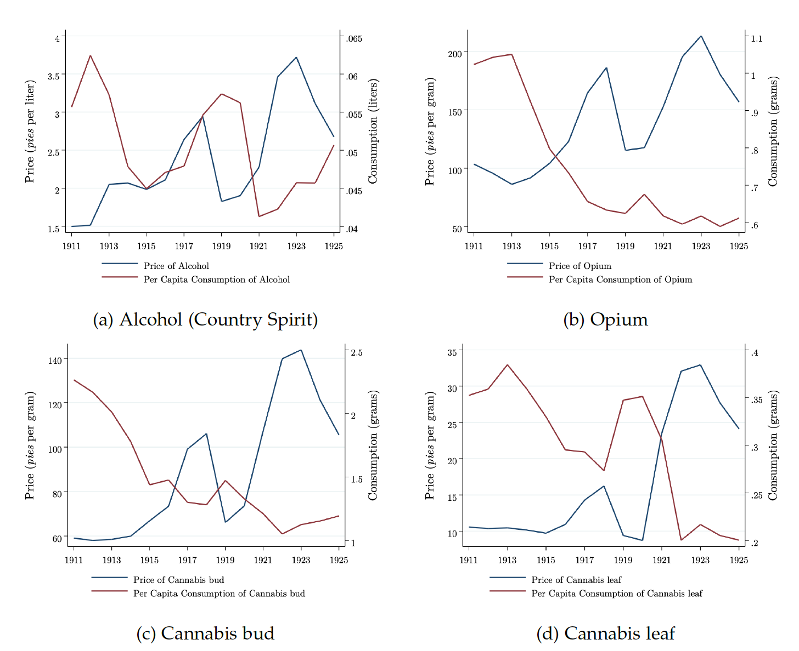

**Aim**: We study whether consumers treat alcohol, cannabis, and opiates as substitutes or complements in a legal regime. We also show evidence of habit formation consistent with addiction and responsiveness towards the prices of these substances. 

**Methods**: We model consumption of alcohol, *bhang* (cannabis leaf), *ganja* (cannabis bud), and opium as a function of past consumption, own prices, the prices of other substances, and wages using dynamic panel data methods. We use data on twenty-five districts from Bengal, India, from 1911 to 1925 for estimation.

**Results**: Consistent with the literature, we find evidence of habit formation for all these substances. Analysis shows that alcohol is a substitute for cannabis bud and a complement for cannabis leaf and opium. Cannabis leaf is a compliment for alcohol and a substitute for cannabis bud, however, neither cannabis bud nor opium consumption respond to changes in the prices of other substances. Further consumption of alcohol, opium, and cannabis leaf is unresponsive to its own price, and alcohol, cannabis bud, and opium are unresponsive to changes in wages. 

**Conclusions**: Alcohol consumption is interrelated with the consumption of all three other substances. Three drugs display limited price or wage responsiveness. Therefore, understanding these substances' consumption patterns can inform harm reduction strategies.

