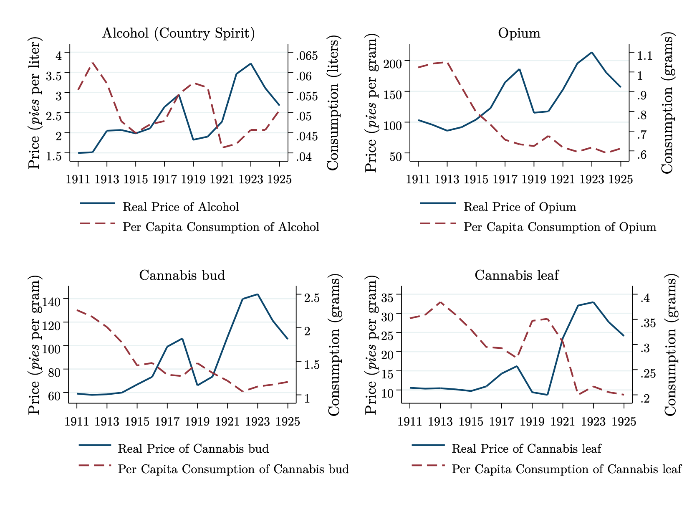

**Aim**: Understanding the behavior of populations of drug consumers has been and remains a topic of keen interest to researchers. We analyze the following set of research questions of contemporary interest. The first is whether consumers treat alcohol, cannabis, and opiates as substitutes or complements in a legal regime. Second, we explore evidence of habit formation consistent with addiction and responsiveness to changes in prices of these substances. 

**Methods**: Using data on twenty-five districts from Bengal, India, from 1911 to 1925, we model consumption of alcohol, *bhang* (cannabis leaf), *ganja* (cannabis bud), and opium as functions of past consumption, own prices, prices of other substances, and wages using dynamic panel data methods. 

**Results**: Consistent with the literature, we find evidence (i) of habit formation for all of these substance, and that (ii) alcohol is a substitute for cannabis bud and a complement for cannabis leaf and opium, (iii) cannabis leaf is a complement for alcohol and a substitute for cannabis bud, but neither cannabis bud nor opium consumption responds to changes in the prices of other substances, (iv) consumption of alcohol, opium, and cannabis leaf are only slightly responsive to their own prices, and (v) alcohol, cannabis bud, and opium are only slightly responsive to changes in wages. 

**Conclusions**: Alcohol consumption is interrelated with the consumption of all three other substances. Three drugs display limited price or wage responsiveness. Understanding how the consumption patterns of these substances respond to economic incentives informed harm reduction strategies in the early 20th century and can continue to do so.

