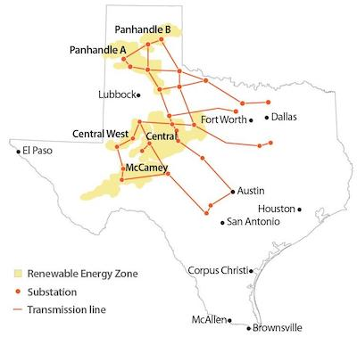

Expanding the power grid is a key factor to achieve decarbonization and fully utilize the benefits of renewable energy. This paper examines the impact of large-scale grid expansion on price-cost markups and emissions from fossil fuel generators in the short-run and wind investment in the long-run. I focus on the rollout of a grid expansion project that linked windy areas in west Texas to population centers in the east. Results suggest moderate declines in markups and emissions with total annual benefits of roughly $285 million. Counties that received investment in transmission infrastructure saw higher wind capacity in the long-run, avoiding $271 million worth of carbon emissions in 2019. These findings highlight the potential to unlock large economic benefits from transmission expansion across the US.

